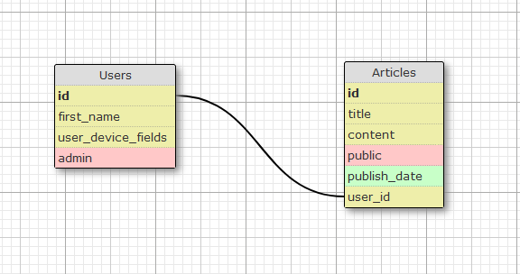

# Basic Blog

Be sure to bundle & yarn install as well as rails db:create db:migrate db:seed

### Gems additionally added(template excluded)
faker, impressionist, pg-search and kaminari

## Flow of building

1. Created a db schema\
Two Models with 1:N relation (1 User to many articles)\
first model: User with device as gem. Also includes first_name as string and admin as boolean\
Second model: Article including title, content as string, public as boolean and publish_date as date. Also foreign key.\
2. Using template to create rails app, which includes already **bootstrap, simple form, debugging gems** and **devise install** with a generated User model.\
3. Test quickly if rails server is running. Create repository on git and do first commit, push and change to new branch.\
4. Add columns to User model and create Article model with necessary columns.\
5. Defining the routes, adding relation from articles to user model and creating articles controller.\
6. Creating view for article index and start using faker gem for seeding the DB.\
7. Adding seeds and include default values for admin (User) and public (Article).\
8. Including new and create in the articles controller.\
9. Adding impressionist gem for view count.\
10. Adding pg-search gem in order to search for articles.\
11. Added small statement in case signed user has not first_name.\
12. Adding paging with kaminari gem.\
13. Centralizing content and making table for the index.\
14. In index added additional statement that only public or articles where user is same to current are visible.\
15. Added some admin rights. If public is false admin can still see as well as delete every article.\
16. User can edit his name.

## Problems faced: 
1. Admin default value went to true upon creating random user. Change to migration solved that.
2. Added default value too early for publish. Removing it with migration.
3. Tried to have public as false if unchecked in simple_form but didn't work out. Did 1 line if statement in the controller instead.
4. Realized that content in articles should be a text and not a string due to its limitations.
5. Pagination and Kaminari didn't work well at first, so needed to add a statement in case query is present or not.
